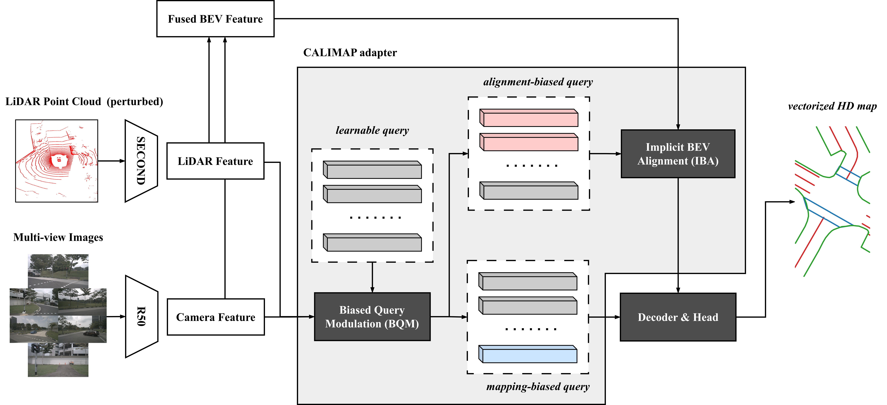
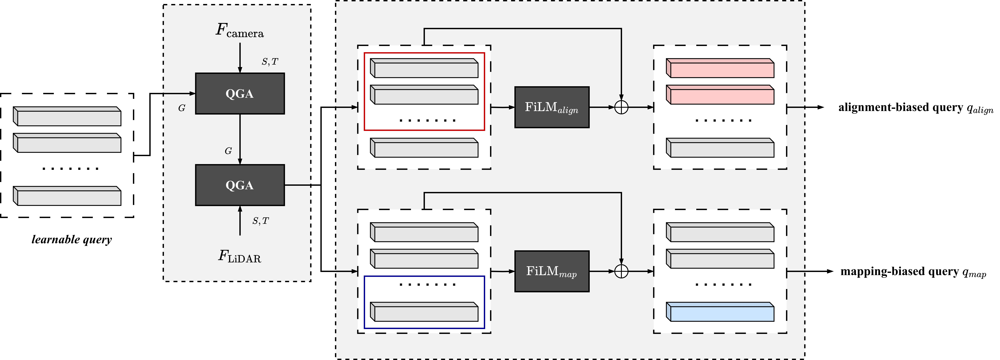
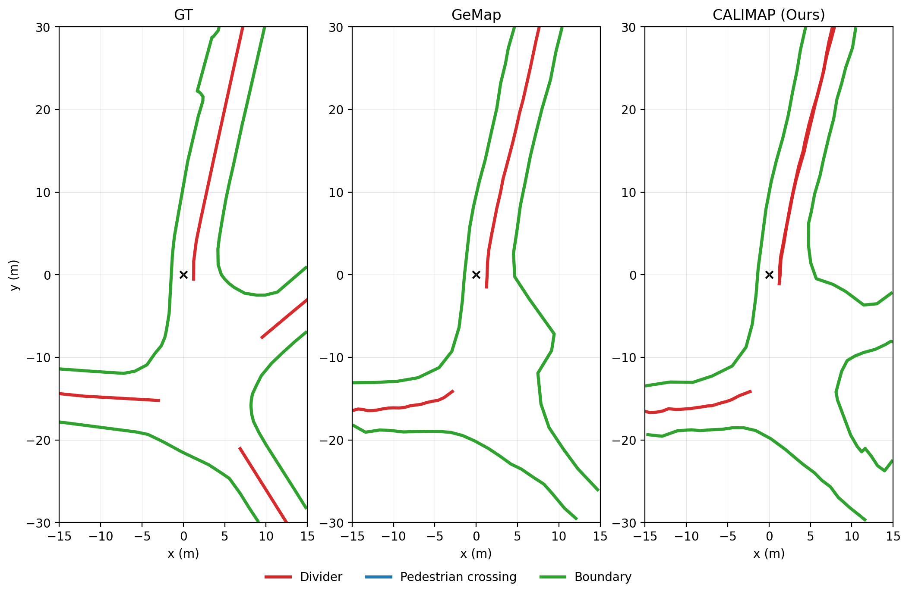
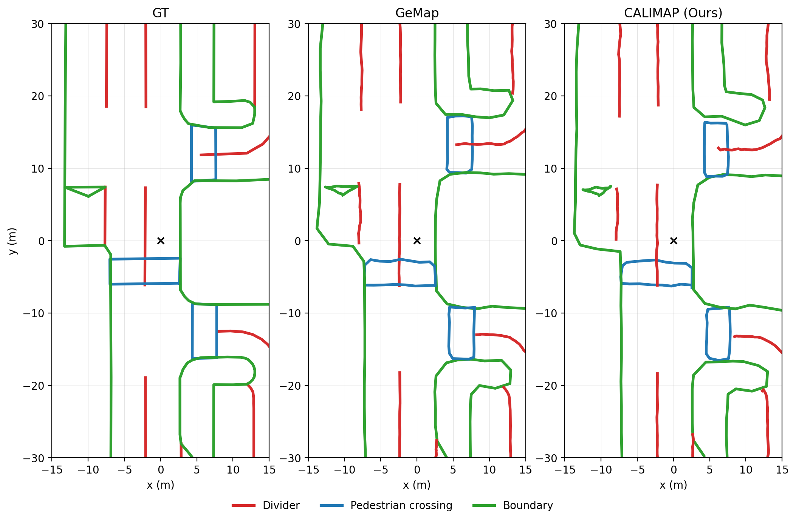
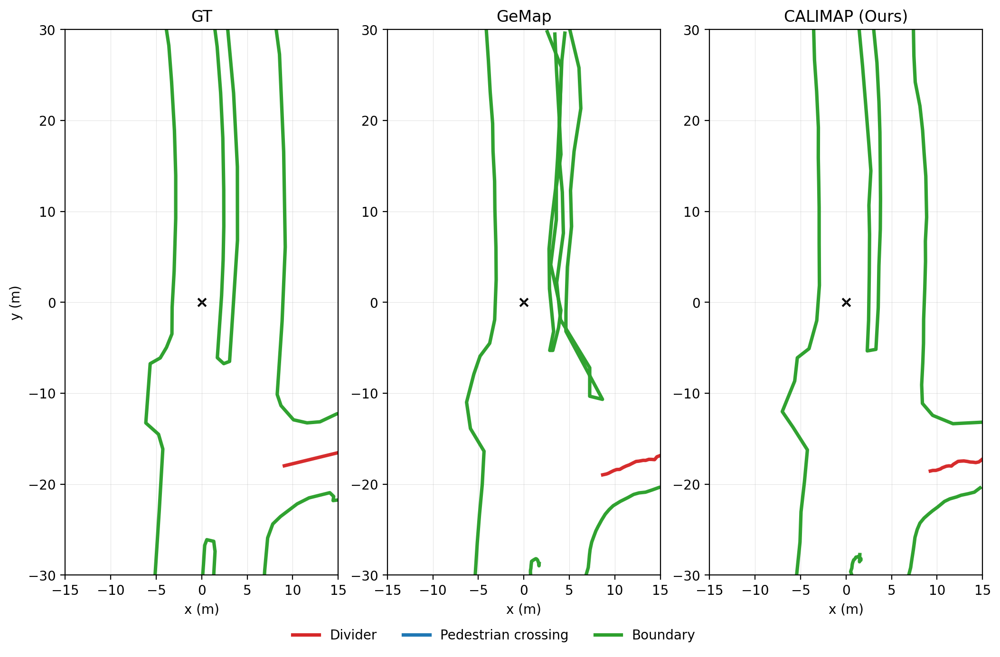
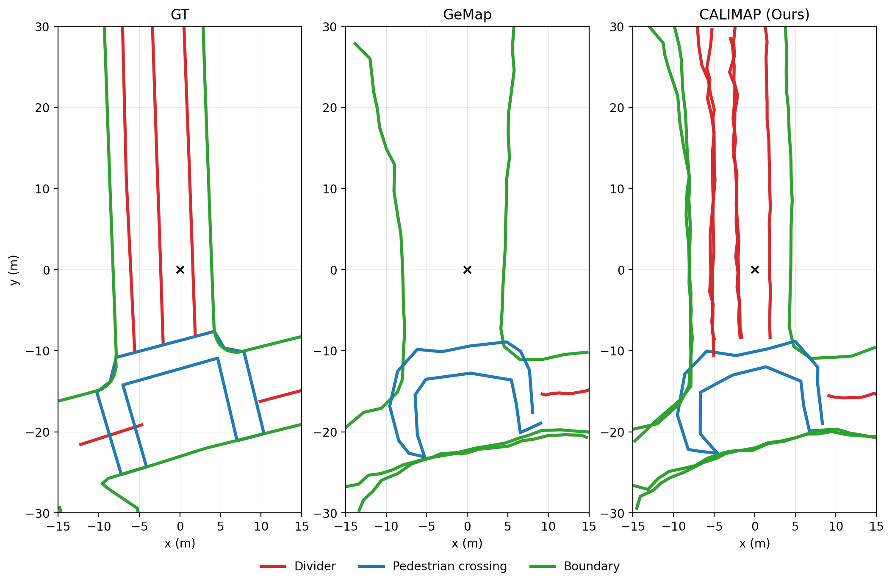

# CALIMAP

## CALIMAP: Plug-and-Play Query Adaptation for Robust Vectorized HD Map Construction

**Accepted at ACCV 2026**

CALIMAP is a plug-and-play adaptation framework for robust online vectorized HD map construction under camera-LiDAR misalignment.

CALIMAP adapts both the decoder query and the fused BEV representation while preserving the pretrained map constructor.  
Biased Query Modulation (BQM) incorporates camera-LiDAR context into the shared map query and generates **alignment-biased** and **mapping-biased** queries.  
Implicit BEV Alignment (IBA) uses the alignment-biased query to adjust the fused BEV representation, while the mapping-biased query is used for map prediction.  
Query-Guided Aggregation (QGA) provides lightweight context aggregation in both BQM and IBA.

<p align="center">
  
</p>


## Method Overview

CALIMAP consists of three core modules: **Query-Guided Aggregation (QGA)**, **Biased Query Modulation (BQM)**, and **Implicit BEV Alignment (IBA)**.

### Query-Guided Aggregation (QGA)

QGA uses guide tokens to aggregate important context from source tokens and update target tokens through a lightweight gated residual mechanism.  
It is used in both BQM and IBA for camera-LiDAR context aggregation and BEV representation adaptation.

### Biased Query Modulation (BQM)

BQM incorporates camera and LiDAR context into the shared map query through QGA.  
It then generates two task-specific query representations: an **alignment-biased query** for BEV alignment and a **mapping-biased query** for map decoding.

<p align="center">
  
</p>

### Implicit BEV Alignment (IBA)

IBA uses the alignment-biased query generated by BQM to adjust the fused BEV representation.  
It combines query-to-BEV correspondence with QGA-based BEV context aggregation to generate aligned BEV tokens for the decoder.

During adaptation, the pretrained encoder, decoder, and prediction head remain frozen. Only the CALIMAP adapter and shared query are trained.


## Qualitative Results

<p align="center">
  
  
</p>

<p align="center">
  
  
</p>

## Code

The code is currently being cleaned and organized for public release.  
The official implementation will be released in this repository soon.

## Citation

If you find this work useful, please consider citing:

```bibtex
@inproceedings{
  kim2026calimap,
  title={{CALIMAP}: Plug-and-Play Query Adaptation for Robust Vectorized {HD} Map Construction},
  author={Juyoung Kim and Ji-Hong Park and Sang-Min Choi and Gun-Woo Kim},
  booktitle={Eighteenth Asian Conference on Computer Vision},
  year={2026},
  url={https://openreview.net/forum?id=JzMRYM38s8}
}
```
